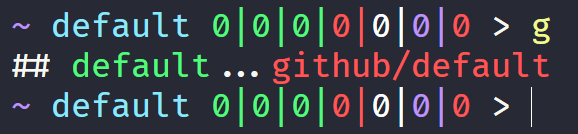

# Prompt

A lightweight prompt consistent across sh/dash/ash, zsh, and pwsh.

# Installing and Using

I don't use any shell plugin frameworks (zgen/zplug/etc) to manage my prompt. My dotfiles are set up to include this repo as a submodule. When sourcing the shell profile, if this repo path does not exist, the shell profile runs `git submodule init --recursive` to clone in my shell plugins.

Then its just a matter of sourcing the relevant prompt file from the shell profile.

For an example see my [`dotfiles`](https://github.com/nathanblair/dotfiles) and perhaps as a more specific example, my [`zshrc`](https://github.com/nathanblair/dotfiles/blob/default/.zshrc).

# Section Explanations

## Last Exit Status

If the last command exit code was not 0, shows the last exit code value.

## Host

If `SSH_CLIENT` is defined, will show the `host` name.

**Not defined for `pwsh` yet**

## Current Context

### Directory

If not in a version-controlled directory, this section will show the current shortened path (accounting for `~` substitution).

### Version Control

**NOTE** Only `git` has been implemented so far; no `svn` or `hg` support (yet).

If the current path is a version-controlled directory, this section will show the `dirname` of the path (suggesting the repository name) followed by the current branch.

Then, multiple columns will enumerate `git` state.

1. New entry **A**dded
2. **R**enamed
3. **M**odified
4. **D**eleted
5. **M**odified
6. **??** New file
7. **D**eleted

- The number at each index indicates the number of files that correspond to that state
- The 4 left-most columns show staged operations.
- The 3 right-most columns track unstaged operations.

See [here](https://www.git-scm.com/docs/git-status#_short_format) for more information about the columns output.

- `git` stash

There is a section for contextually showing the status of the `git stash`.

- `git` ahead/behind

Will show number of commits ahead and/or behind the remote tracking branch when applicable.

## Prompt

Shows the prompt character (`>`)

## Right Prompt

Shows last command execution time in seconds if duration was longer than 1 second.
